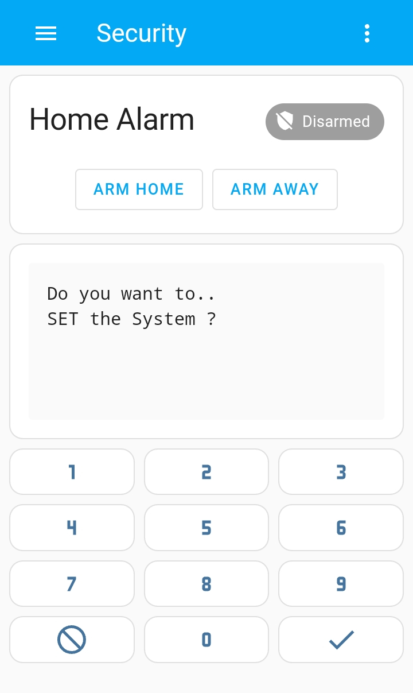

# Gardtec Keypad

This project emulates physical Gardtec keypad for alarm panel GT490X. Hardware part is implemented in Arduino platform on ATmega328 micro-controller. Python application suppose to run on the Raspberry Pi which connects to the micro-controller via I2C bus. The app captures status messages from the panel and forwards them via MQTT `gardtec/status` to the Home Assistant. Keys [0-9, A, B] can be sent to the panel via another MQTT topic `gardtec/keypad`.

## Hardware

To tap the micro-controller to the Gardtec 4-wire bus a level shifter is needed that is capable to convert signals as low as 1.5V to as high as 18V and vice versa, for example [Pololu](https://www.pololu.com/product/2595).

The easiest way to assemble the hardware is to solder the level shifter to a small plug-on board for Raspberry Pi that is called the [RasPiO® Duino](https://rasp.io/duino/). See [the schematic](gardtec/gardtec.pdf). The ATmega328 chip is fully programmable from the Raspberry Pi via SPI bus.

## Programming ATmega328

Configure Arduino platform, AVR programmer and the board as described in [raspio-duino.md](raspio-duino.md).

Up to 4 RKPs (Remote Keypads) may be fitted to the GT490X control panel on a 4 wire BUS. If you have Gardtec original remote keypad on the bus, make it the second keypad by installing keypad #2. It should be noted the there are no jumpers in the RKP to ident them this is done from the program option (see GT490X Engineer’s Reference Guide). Once the second keypad is installed, the panel will signal that the first keypad is tampered or gone. Be prepared to enter your master / engineering codes to silence alarm.

The program is configured to act as the keypad #1. If you need to change that, modify `keypadNum` variable at the top of `.ino` file.

Compile and upload keypad program to the micro-controller:

```bash
arduino-cli lib install --git-url https://github.com/rlogiacco/CircularBuffer.git
arduino-cli compile -P gpio -b arduino:avr:gert328 gardtec/ -v
arduino-cli upload  -P gpio -b arduino:avr:gert328 gardtec/ -v
```

Once the program is uploaded and the keypad is connected to the bus, enter master code again to reset the alarm panel. It should recognize the new keypad installed. 

## Usage

The Raspberry Pi communicates with the ATmega328 micro-controller via I2C bus. Make sure that I2C interface is enabled on the Raspberry Pi and the user who runs the app belongs to `i2c` group.

```bash
./gardtec.py --help
usage: gardtec.py [-h] [-d DEVICE] [-a ADDRESS] [-i INTERVAL] [-l LOG_LEVEL]

Gardtec Remote Keypad for Alarm Control Panel GT490X

options:
  -h, --help            show this help message and exit
  -d DEVICE, --device DEVICE
                        I2C device path (default: /dev/i2c-1)
  -a ADDRESS, --address ADDRESS
                        device I2C address (default: 86)
  -i INTERVAL, --interval INTERVAL
                        update interval in seconds (default: 0.2)
  -l LOG_LEVEL, --log-level LOG_LEVEL
                        log level (default: info)
```

The hostname or IP address of the remote MQTT broker can be set using `MQTT_HOST` environmental variable.

## Home-Assistance

### Card

<p align="center">
  
</p>

<details>
<summary>Expand Card Configuration</summary>

```yaml
type: vertical-stack
cards:
  - type: markdown
    content: <pre>{{ states('sensor.gardtec_status') }}<pre>
  - type: horizontal-stack
    cards:
      - show_name: false
        show_icon: true
        type: button
        tap_action:
          action: call-service
          service: mqtt.publish
          data:
            topic: gardtec/keypad
            payload: '1'
        hold_action:
          action: none
        icon: mdi:numeric-1
        icon_height: 30px
      - show_name: false
        show_icon: true
        type: button
        tap_action:
          action: call-service
          service: mqtt.publish
          data:
            topic: gardtec/keypad
            payload: '2'
        hold_action:
          action: none
        icon: mdi:numeric-2
        icon_height: 30px
      - show_name: false
        show_icon: true
        type: button
        tap_action:
          action: call-service
          service: mqtt.publish
          data:
            topic: gardtec/keypad
            payload: '3'
        hold_action:
          action: none
        icon: mdi:numeric-3
        icon_height: 30px
  - type: horizontal-stack
    cards:
      - show_name: false
        show_icon: true
        type: button
        tap_action:
          action: call-service
          service: mqtt.publish
          data:
            topic: gardtec/keypad
            payload: '4'
        hold_action:
          action: none
        icon: mdi:numeric-4
        icon_height: 30px
      - show_name: false
        show_icon: true
        type: button
        tap_action:
          action: call-service
          service: mqtt.publish
          data:
            topic: gardtec/keypad
            payload: '5'
        hold_action:
          action: none
        icon: mdi:numeric-5
        icon_height: 30px
      - show_name: false
        show_icon: true
        type: button
        tap_action:
          action: call-service
          service: mqtt.publish
          data:
            topic: gardtec/keypad
            payload: '6'
        hold_action:
          action: none
        icon: mdi:numeric-6
        icon_height: 30px
  - type: horizontal-stack
    cards:
      - show_name: false
        show_icon: true
        type: button
        tap_action:
          action: call-service
          service: mqtt.publish
          data:
            topic: gardtec/keypad
            payload: '7'
        hold_action:
          action: none
        icon: mdi:numeric-7
        icon_height: 30px
      - show_name: false
        show_icon: true
        type: button
        tap_action:
          action: call-service
          service: mqtt.publish
          data:
            topic: gardtec/keypad
            payload: '8'
        icon: mdi:numeric-8
        hold_action:
          action: none
        icon_height: 30px
      - show_name: false
        show_icon: true
        type: button
        tap_action:
          action: call-service
          service: mqtt.publish
          data:
            topic: gardtec/keypad
            payload: '9'
        icon: mdi:numeric-9
        hold_action:
          action: none
        icon_height: 30px
  - type: horizontal-stack
    cards:
      - show_name: false
        show_icon: true
        type: button
        tap_action:
          action: call-service
          service: mqtt.publish
          data:
            topic: gardtec/keypad
            payload: A
        hold_action:
          action: none
        icon: mdi:cancel
        icon_height: 30px
      - show_name: false
        show_icon: true
        type: button
        tap_action:
          action: call-service
          service: mqtt.publish
          data:
            topic: gardtec/keypad
            payload: '0'
        icon: mdi:numeric-0
        hold_action:
          action: none
        icon_height: 30px
      - show_name: false
        show_icon: true
        type: button
        tap_action:
          action: call-service
          service: mqtt.publish
          data:
            topic: gardtec/keypad
            payload: B
        icon: mdi:check
        hold_action:
          action: none
        icon_height: 30px
```
</details>

### MQTT Sensor

```yaml
- name: gardtec_status
  state_topic: "gardtec/status"
```
